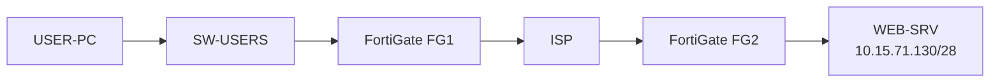
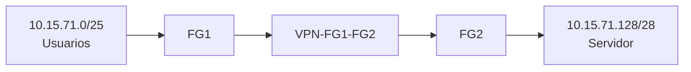

# Infraestructura 1 - VPN Site-to-Site entre FortiGate

## Video demostrativo

https://youtu.be/X9XNudyzHuQ

---

**Estudiante:** Oliver Eliam Aquino Paulino  
**Matrícula:** 20241571  
**Asignatura:** Seguridad de Redes  

## Descripción

Esta infraestructura implementa una comunicación segura entre una red de usuarios y una red remota donde se encuentra un servidor web. Para unir ambas redes se utiliza una **VPN Site-to-Site IPsec entre dos FortiGate**, pasando por un ISP simulado.

El objetivo principal es comprobar que el usuario puede comunicarse con el servidor únicamente cuando el túnel VPN está disponible. Además, se validan VLAN, DHCP, NAT, enrutamiento y acceso HTTPS.

## Objetivo

- Comunicar la red de usuarios con la red del servidor mediante una VPN Site-to-Site.
- Mantener separadas las redes privadas del segmento WAN.
- Permitir salida por NAT desde ambos extremos.
- Probar acceso HTTPS hacia el WEB-SRV.
- Demostrar que al desactivar la VPN la comunicación con la red remota deja de funcionar.

## Topología



### Flujo de comunicación



## Componentes principales

| Equipo | Función |
|---|---|
| USER-PC | Equipo cliente de la VLAN 10 |
| SW-USERS | Switch de acceso para la red de usuarios |
| FG1 | Gateway de usuarios, DHCP, NAT y extremo VPN |
| ISP | Transporte entre las WAN de ambos FortiGate |
| FG2 | Gateway de la red del servidor, NAT y extremo VPN |
| WEB-SRV | Servidor Nginx con HTTPS en TCP/443 |

## Direccionamiento

| Elemento | Dirección / Red | Función |
|---|---|---|
| VLAN 10 - Usuarios | 10.15.71.0/25 | Red de usuarios |
| FG1 VLAN10-USERS | 10.15.71.1/25 | Gateway de usuarios |
| DHCP | 10.15.71.2 - 10.15.71.126 | Pool para clientes |
| FG1 port1 | 192.168.200.2/24 | Administración |
| FG2 port1 | 192.168.200.3/24 | Administración |
| FG1 port3 | 203.0.113.157/30 | WAN hacia ISP |
| ISP Fa0/0 | 203.0.113.158/30 | Enlace hacia FG1 |
| ISP Fa1/0 | 198.51.100.157/30 | Enlace hacia FG2 |
| FG2 port3 | 198.51.100.158/30 | WAN hacia ISP |
| ISP Loopback0 | 192.0.2.157/32 | Pruebas |
| Red WEB | 10.15.71.128/28 | Red del servidor |
| FG2 port2 | 10.15.71.129/28 | Gateway del servidor |
| WEB-SRV | 10.15.71.130/28 | Servidor HTTPS |

## VLAN 10 y DHCP

La red de usuarios utiliza la **VLAN 10**.

En FG1 se creó la interfaz:

- Nombre: `VLAN10-USERS`
- Interfaz padre: `port2`
- VLAN ID: `10`
- IP: `10.15.71.1/25`

El servicio DHCP entrega:

- Rango: `10.15.71.2 - 10.15.71.126`
- Gateway: `10.15.71.1`
- DNS: `8.8.8.8`

En el switch:

- `Gi0/0`: puerto access VLAN 10 hacia USER-PC.
- `Gi0/1`: trunk VLAN 10 hacia FG1.

## Enlaces WAN e ISP

FG1 utiliza `203.0.113.157/30` y su siguiente salto es `203.0.113.158`.

FG2 utiliza `198.51.100.158/30` y su siguiente salto es `198.51.100.157`.

El ISP solamente transporta el tráfico entre ambos extremos y también posee la Loopback `192.0.2.157/32` para pruebas.

## VPN Site-to-Site

### FG1

- Túnel: `VPN-FG1-FG2`
- Interfaz WAN: `port3`
- Peer remoto: `198.51.100.158`
- Red local: `10.15.71.0/25`
- Red remota: `10.15.71.128/28`
- Propuestas configuradas: `des-md5` y `des-sha1`

### FG2

- Túnel: `VPN-FG2-FG1`
- Interfaz WAN: `port3`
- Peer remoto: `203.0.113.157`
- Red local: `10.15.71.128/28`
- Red remota: `10.15.71.0/25`
- Propuestas configuradas: `des-md5` y `des-sha1`

La PSK no se publica en este repositorio.

## Rutas

Cada FortiGate tiene:

1. Una ruta por defecto hacia el ISP.
2. Una ruta hacia la red privada remota utilizando la interfaz VPN.

En FG1, el tráfico destinado a `10.15.71.128/28` sale por `VPN-FG1-FG2`.

En FG2, el tráfico destinado a `10.15.71.0/25` sale por `VPN-FG2-FG1`.

## Políticas de firewall y NAT

### FG1

- `USERS-to-WAN-NAT`: permite salida de usuarios hacia WAN con NAT.
- `vpn_VPN-FG1-FG2_local_0`: permite usuarios hacia la red remota por VPN.
- `vpn_VPN-FG1-FG2_remote_0`: permite el tráfico de retorno desde la VPN.

### FG2

- `SERVER-to-WAN-NAT`: permite salida de la red del servidor hacia WAN con NAT.
- `vpn_VPN-FG2-FG1_local_0`: permite tráfico desde la red del servidor hacia la VPN.
- `vpn_VPN-FG2-FG1_remote_0`: permite el tráfico de retorno desde la red de usuarios.

El tráfico interno de la VPN se mantiene sin NAT.

## Servidor WEB

El servidor utiliza:

- IP: `10.15.71.130/28`
- Gateway: `10.15.71.129`
- Servicio: Nginx
- Protocolo: HTTPS
- Puerto: TCP/443

Se configuró un certificado autofirmado para realizar las pruebas HTTPS del laboratorio.

## Pruebas realizadas

Desde USER-PC se verificó:

```bash
ip addr show eth0
ip route
ping 10.15.71.130
traceroute 10.15.71.130
wget --no-check-certificate -O- https://10.15.71.130
```

### Resultado

| Prueba | Resultado |
|---|---|
| DHCP | Correcto |
| Ping hacia WEB-SRV | Correcto con VPN activa |
| HTTPS/443 | Correcto con VPN activa |
| Traceroute | Llega a la red remota |
| VPN desactivada | El acceso al servidor falla |
| VPN reactivada | La comunicación se restablece |

La prueba de desactivar y volver a activar el túnel demuestra que la conectividad entre ambas redes depende directamente de la VPN Site-to-Site.

## Archivos del repositorio

### Documentación

- [Documentación PDF completa](Documentacion_Infraestructura1_VPN_Oliver_Aquino.pdf)

### Running-Configs

- [ISP](running-configs/ISP_running-config.txt)
- [SW-USERS](running-configs/SW-USERS_running-config.txt)
- [FG1 - Backup completo sanitizado](running-configs/FG1_FortiGate_BACKUP_COMPLETO_SANITIZADO.conf)
- [FG2 - Backup completo sanitizado](running-configs/FG2_FortiGate_BACKUP_COMPLETO_SANITIZADO.conf)
- [FG1 - Configuración relevante](running-configs/FG1_configuracion_relevante.conf)
- [FG2 - Configuración relevante](running-configs/FG2_configuracion_relevante.conf)
- [WEB-SRV](running-configs/WEB-SRV_configuracion.sh)

### Scripts y pruebas

- [Configuración completa y pruebas](scripts/Configuracion_Completa_y_Pruebas_Infraestructura1.md)
- [Scripts y comandos](scripts/Scripts_Comandos_Infraestructura1.txt)
- [Comandos de pruebas](scripts/Comandos_Pruebas_Infraestructura1.txt)
- [Direccionamiento y puertos](scripts/Direccionamiento_y_Puertos_Infraestructura1.txt)
- [Configuración WEB-SRV](scripts/WEB-SRV_configuracion.txt)

## Conclusión

La infraestructura cumple el objetivo planteado. La red de usuarios y la red del servidor se comunican mediante una VPN Site-to-Site entre dos FortiGate. Se validaron VLAN 10, DHCP, NAT, enrutamiento, acceso HTTPS y la dependencia de la comunicación respecto al túnel VPN.

> Los archivos públicos de configuración tienen las credenciales, PSK y claves sensibles redactadas.
